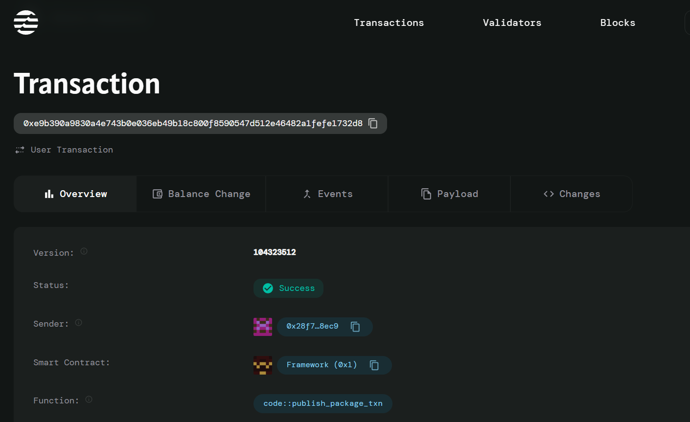

## Project Title
 Aptos SimpleVoting - A Decentralized Voting Smart Contract

## Project Description
SimpleVoting is a decentralized voting system implemented on the Aptos blockchain. It allows users to create voting polls with multiple options and enables participants to cast their votes securely and transparently. The system ensures that each voter can only vote once per poll and that the voting process is tamper-proof.

## Project Vision
The vision of SimpleVoting is to provide a secure, transparent, and decentralized platform for conducting polls and elections. By leveraging blockchain technology, SimpleVoting aims to eliminate fraud, ensure fairness, and empower communities to make collective decisions efficiently.

## Future Scope
- **Result Analysis**: Add functionality to calculate and display poll results.
- **Poll Expiry**: Introduce expiration dates for polls to automatically close voting after a set period.
- **Anonymous Voting**: Implement zero-knowledge proofs to ensure voter anonymity.
- **Multi-Signature Polls**: Enable multi-signature approvals for poll creation.
- **Integration with Wallets**: Provide seamless integration with popular Aptos wallets for user convenience.

## Contract Details
- **Module Address**: `0x28f7aca13358cee8f8e686c3bca7dcde17a74e3bee7b0ab73281c372b2d28ec9`
- **Transaction Hash**: `0xe9b390a9830a4e743b0e036eb49b18c800f8590547d512e46482a1fefe1732d8"

    