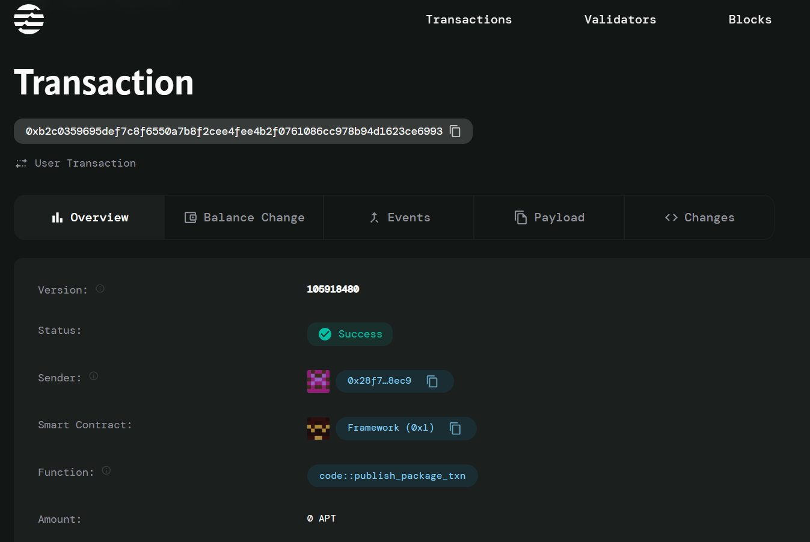

# Blockchain-Based Scholarship Distribution System

A decentralized application (dApp) built on the Aptos blockchain for transparent and efficient scholarship distribution in the education sector.

## Overview

This project implements a blockchain-based solution for managing and distributing educational scholarships. It leverages smart contracts to ensure transparent, efficient, and tamper-proof scholarship allocation.

## Features

- Smart contract-based scholarship distribution
- Transparent selection process
- Automated fund disbursement
- Student verification system
- Real-time tracking of scholarship status
- Immutable record keeping

## Technical Stack

- Blockchain: Aptos
- Smart Contract Language: Move
- Version: 2.0.0

## Prerequisites

- Aptos CLI
- Move Compiler
- Node.js (for frontend, if applicable)

## Getting Started

1. Clone the repository
2. Install dependencies
3. Configure your Aptos wallet
4. Deploy smart contracts

## Smart Contract Structure

The smart contracts handle:
- Scholarship creation and management
- Student verification
- Fund distribution
- Academic record verification

## Contributing

Contributions are welcome! Please read our contributing guidelines before submitting pull requests.

## License

This project is licensed under the MIT License - see the LICENSE file for details.

## Smart contract details

MOdule no.: 0x28f7aca13358cee8f8e686c3bca7dcde17a74e3bee7b0ab73281c372b2d28ec9
Transaction hash: 0xb2c0359695def7c8f6550a7b8f2cee4fee4b2f0761086cc978b94d1623ce6993